# Spring2018
# Project 1: What did the authors write in their horror stories?

----

## Project Description
This is the first and only *individual* (as opposed to *team*) this semester. 

Term: Spring 2018

+ Projec title: The difference and similarity among horror stories of different authors

+ This project is conducted by Xiangyu Liu, Columbia UNI: xl2703

+ Project summary: My goal is to identify and illustrate similarities and differences identified by text mining. Since it is the spooky text dataset, I pay more attention on the comparision between fear words and joy words. If you are also curious about it, please wait and see!

## Part 1: What is the overview of our text?

First, I want to get the overview of the data visualization. I am curious about the frequent words used by these authors. Are these frequent words are all scary words like 'death', 'fear', 'blood'? Let's go and have a look!

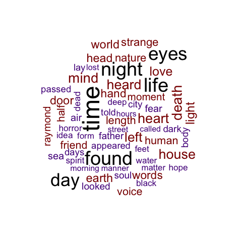

Those are the 60 most common words in my entire `spooky` set. The differene colours represent different frequencies. The most frequency words are labelled as black, which are 'eyes', 'day', 'time', 'life' and 'found'. Among them I can find some scary ones which I guessed before, like 'death', 'life', 'dark', 'black' and 'horror'. But to my surprise, I also find some joy words here, such as 'love', 'hope' and 'friend'. 

In order to compare the similarities and differences among three authors, I try to do the same for each author.

First, let's see Mary's wordcloud:

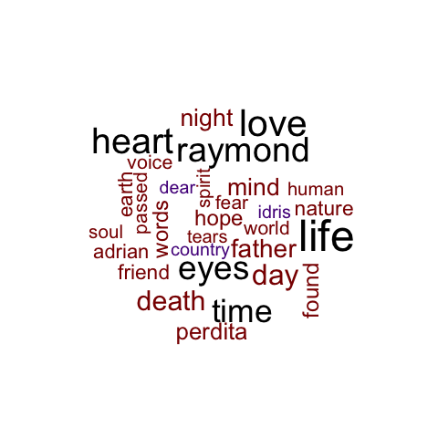

Those are the 30 most common words in the entire Mary's sentences. I notice that the most frequent words of Mary are 'heart', 'time', 'life', 'eys', 'raymond' and 'love'! It seems that Mary use both joy words and scary words frequently.

Let's also take a look at HP's word cloud:

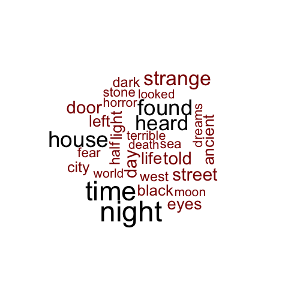

Those are the 30 most common words in the entire HP's sentences. I notice that the most frequent words of HP are 'night', 'time', 'heard', 'house','house'. Up to now, it's hard for me to draw any conclusion regarding HP's preference in using scary words and joy words. Thus, in the next part, I decide to compare the frequency of some strong scary words and joy words among authors.

Finally, let's see Edgar Allan Poe's wordcloud:

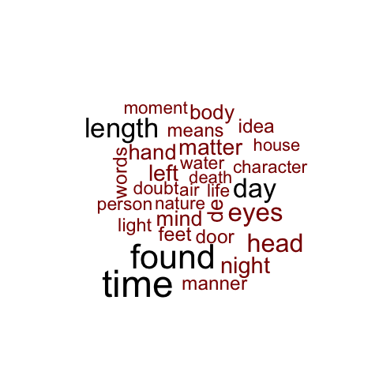

Those are the 30 most common words in the entire Edgar's sentences. I notice that the most frequent words of Mary are 'length', 'time', 'day', 'found'. It seems that Edgar's wordcloud is most similar with the wordcloud of the entire dataset. Is it because Edgar use more words than others?  Thus, I decide to explore the author count and sentence and word length in the next step.

As I have mentioned before, to get a clearer picture and confirm my guess, I count the words of each author as well as their word leangths and sentence lengths.

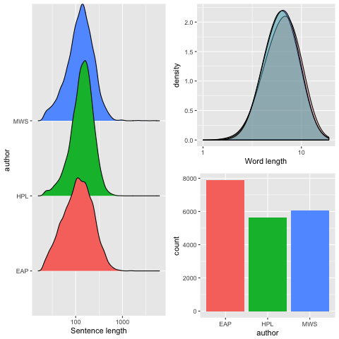

It is so exciting that Edgar's word count is bigger than others. It means that Edgar has more words than others, which confirms my guess in 2.1! In addition, Edgar's word length is also a bit longer than others. HP and Mary seem to have very similar word lengths. However, HP's sentence length is a bit longer than others. It seems that he may like to use shorter sentences.

Since shorter sentences are probably more easier to understand, does it mean it is more easy to read HP's novels than others ?

To conclude, the overview of data visualization part confirms my many conjectures as well as causes more thinkings. In the next part, I decide to explore deeper and get more concise conclusions.

## What are the characteristics of our words?

Word is the smallest unit of the whole text. So let's first compare the characteristics of words among three authors!

In order to explore deeper based on author dependent word clouds, here I want to compare the relative word frequencies between each author. Since we have 3 authors altogether, we have 3 pairs. If the word occurs more than 20 times, then it can be included to the analysis.

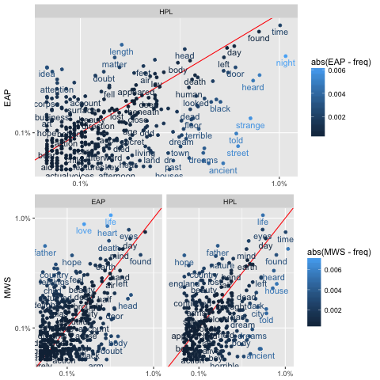

Let me first give a brief explanation of the above picture. If the word is at the top left corner, it means this word is highly used by the anthor on the left side beacuse the relative word frequency of this author is much higher. If the word is at the bottom right corner, it means this word is highly used by the anthor on the top beacuse the relative word frequency of this author is much higher. 

Therefore, I find that Edgar uses 'idea', 'body' more often than others. Mary uses 'father', 'hope' and 'love' more than others. HP uses 'ancient', 'street' more frequently. 

I conclude that Mary are more likely to use joy words than other two authors. Does it mean that Mary's novel is not as scary as others? If yes, then maybe somebody like me can take a try!

Next, I want to choose one of the most popular term-weighting schemes, which is called TF-IDF, not only because it is popular, but also because it is a a numerical statistic that is intended to reflect how important a word is to a document in a collection or corpus. The tf-idf value increases proportionally to the number of times a word appears in the document, but is often offset by the frequency of the word in the corpus. I use TF-IDF to adjust for the fact that some words appear more frequently in general. By the way, TF-IDF is short for term frequency–inverse document frequency.

First, I pick the top twenty tf_idf scores in all the text.

Wow! It is surprising that there are so many names here! I can see 'Perdita', 'Adrian', 'Justine', etc. These names appear more frequently than other words. 

As always, I pay the closest attention to scary words and joy words. However, because of so many names existing, I can not find enough emotional words here. Thus, I decide to do the same TF-IDF analysis on each author in order to explore deeper.

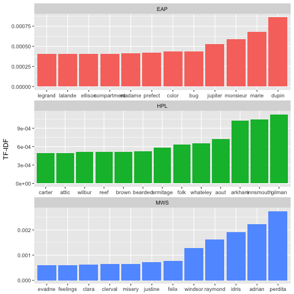

Let's go to find the emotional words here! I can see 'perfect' from Edgar, 'reef' from HP, and 'feelings', 'misery' from Mary. I find that relatively, Mary tends to use more emotional words. However, there are still not so many emotional words here. And I am also confused about what these words are used for. So, in the next part, I would like to do the bigrams and trigrams. And maybe sentiment analysis later...

## What are the characteristics of bigrams and trigrams?

In this part, I want to use bigrams and trigrams to get the meaning of the sentence by separating it into small pieces. Bigrams and trigrams would help me to filter out most name words. 

Bigram can regard words two at a time. Each two adjacent words create a bigram, such as "I read", "read a", "a book", "book about", "about the", "the history", "history of", "of America".

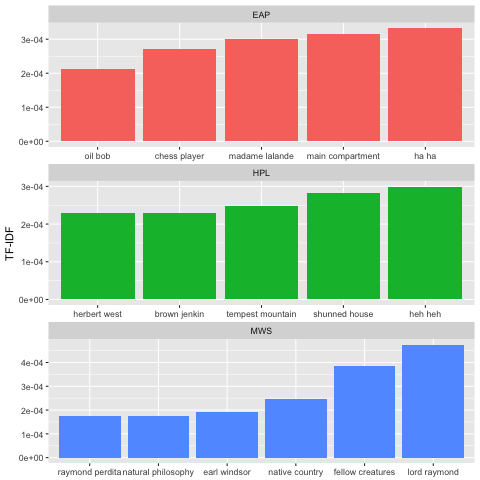

Now, we filter out all the name words here. That's great! I find that Edgar and HP use more joy words than Mary, because they use 'ha ha', 'heh heh' more frequently. For Mary, it seems that she really likes 'lord raymond'! 

Trigrams can regard words three at a time. Each three adjacent words create a trigram, such as "I read a", "read a book", "a book about", "book about the", "about the history", "the history of", "history of America".

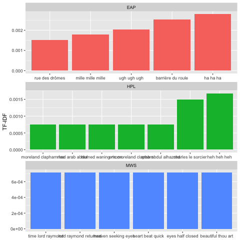

I find that Edgar tends to use more reduplicated words, such as 'mile mile mile', 'ugh ugh ugh' and 'ha ha ha'. It is a unique writing style of Edgar. Mary focuses more on the mental activities of the characters because she talks more about the eyes and hearts. Maybe it is because Mary is the only female author here, so her work has more detailed descriptions than others.

## Sentiment analysis

What is sentiment analysis? Sentiment Analysis is the process of determining whether a piece of writing is positive, negative or neutral. It’s also known as opinion mining, deriving the opinion or attitude of a speaker. I use sentiment analysis to explorer deeper into the fear words and joy words of each author.

In the following pictures, I get specific sentiment lexicons of each author. Although there are so many categories here, I just care about the fear words and joy words. First, let's look at Mary's!

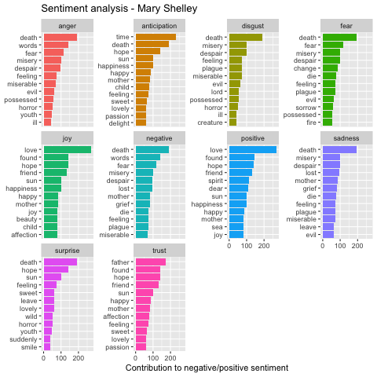

For Mary, the fear words are less than joy words. It just confirms my guess at 3.1 that Mary are more likely to use joy words than other two authors. She uses fear words like 'death', 'fear', 'misery', etc. She uses joy words like 'love', 'found', 'hope', etc.

Then let's look at HP's!

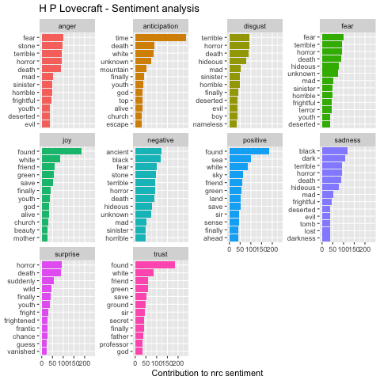

In general, HP uses fear words more often than joy words! He uses fear words like 'fear', 'terrible', 'horror', etc. He uses joy words like 'found', 'white', 'friend', etc. In addtion, it is obvious that he uses 'found' much more frequently than other words. So I conclude that HP's novel also includes suspenseful stories.

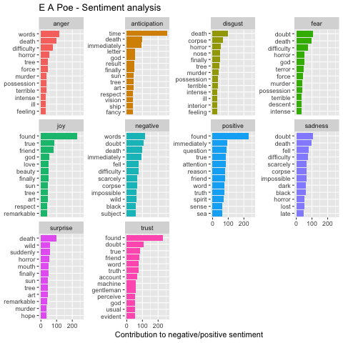

Wow! Edgar uses even more 'frequent's than HP. It seems that they both love suspential plots and their writing styles may be similar. Edagr uses fear words like 'doubt', 'death', 'difficulty', etc. He uses joy words like 'found', 'true', 'friend', etc. The joy words used by Edgar are also similar to those used by HP.

A word cloud is a graphical representation of word frequency. Instead of making a simple wordcloud, I want to make a comparison one, that is, to compare all these different emotional words in a single word cloud. 

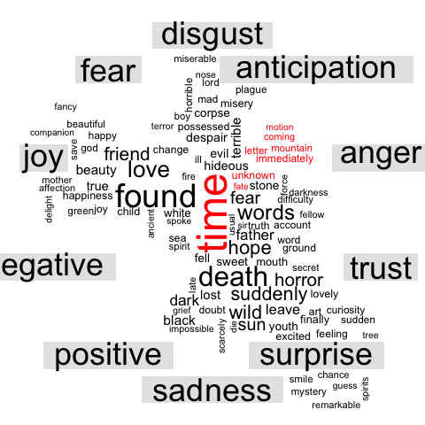

From this picture, we can find that although we do analysis on the spooky text, fear words are only a small fraction of the whole text. So I decide to pick some strong fear words and joy words randomly and compare the frequency of these words among three authors.

I choose these fear words and joy words purely randomly (not influenced by the outcome above) and want to see the frequency of words within the same category.

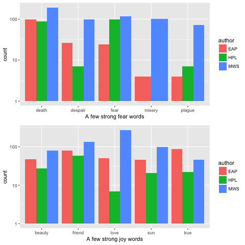

For the fear words, I find that Edgar uses 'death', 'deapair' and 'fear' more frequently. HP doesn't like the word 'misery'. The frequency of these fear words used by Mary are very similar.

For the joy words, I find that HP doesn't like to use the word 'love'. However, Mary uses it very often. The frequency of these joy words used by Mary and Edgar are very similar.

Here I want to get the fraction of fear words by joy words persentence. First, I choose all the fear words and count their fraction among the sample of fear terms plus joy terms, which is  # fear / (# fear + # joy). Then I plot the distribution of the fraction of fear words for the three authors:

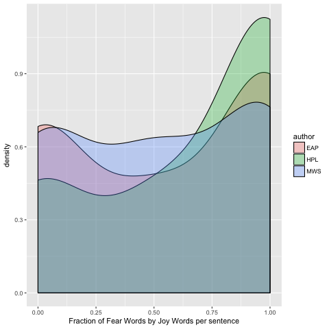

The distribution of the fraction of fear words per sentence is clearly skewed towards larger values for HP (green) than in the case of MWS and EAP. The difference between Shelley and Poe is more subtle. 

## What are top popular topics?

A 'topic' consists of a cluster of words that frequently occur together. In this part, I use topic modeling to connect words with similar meanings and distinguish between uses of words with multiple meanings. 
 
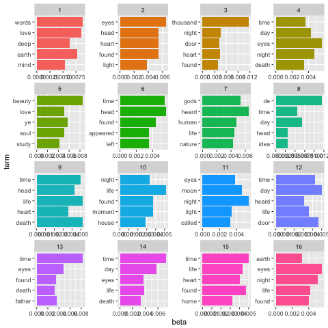

I grab 5 words for each topic and here are 16 top topics. I see that for instance topic 1 contains words such as “love” and “mind”, while topic 4 prominently features “death” and topic 5 has the word “beauty”. We also see several overlaps between topics such as “found” or “time”. 

I am also curious about how how these topics relate to our three authors. So I build a treemap here. 

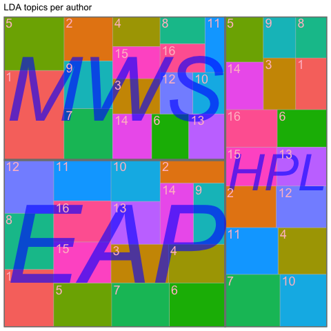

There are 17 topic related to Mary; 16 topics related to HP; 16 topics related to Edgar. I find that topic 1 and topic 5 are more related to Mary's novel ;topic 8 and topic 15 are more realted to Edgar's nove.

## What are the influence of stop words?

In the end, I want to find some interesting things about the stop words. Also I choose 6 stop words randomly and see the frequency of them among three authors.

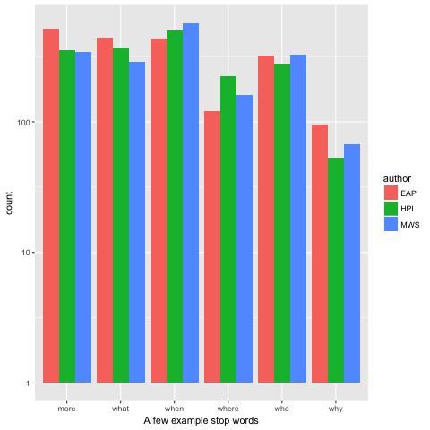

I can not find too many differences on the use of these different stop words among the authors. Thus, it is reasonable to filter them out at first, as what I did.

 

